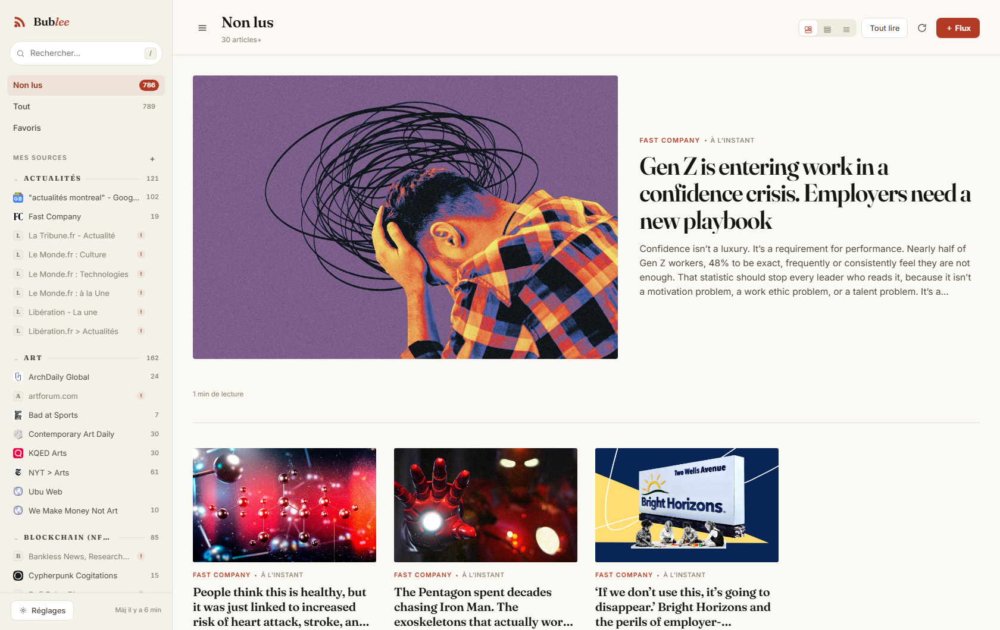
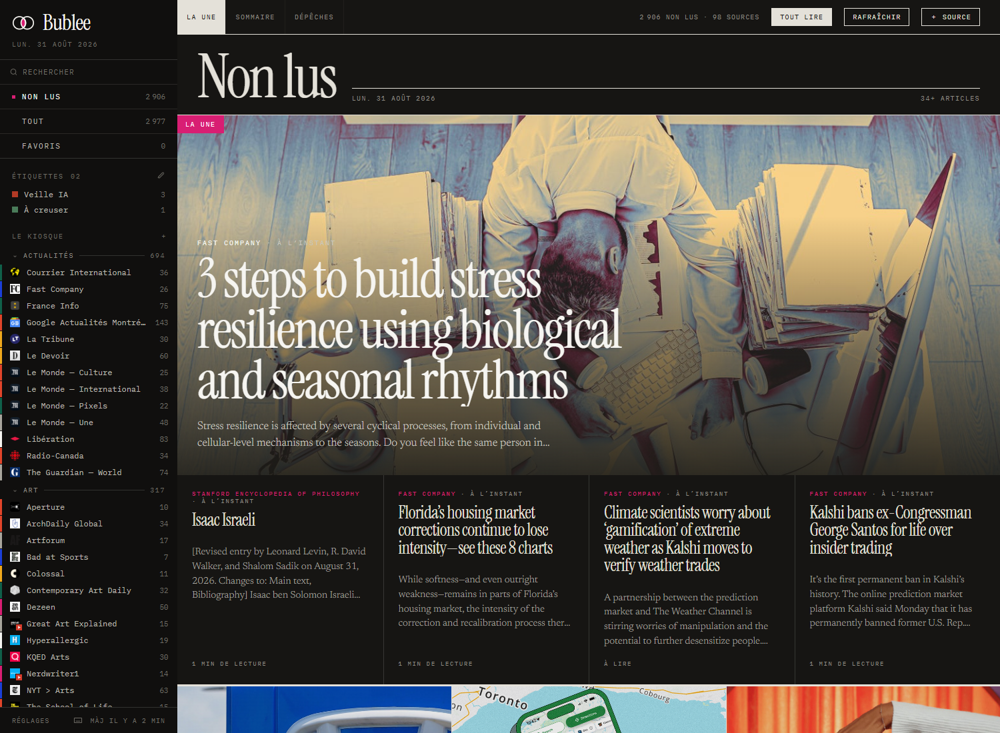
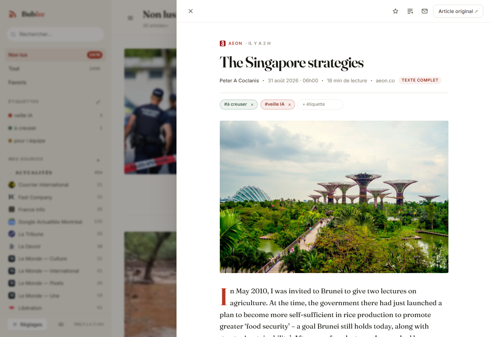
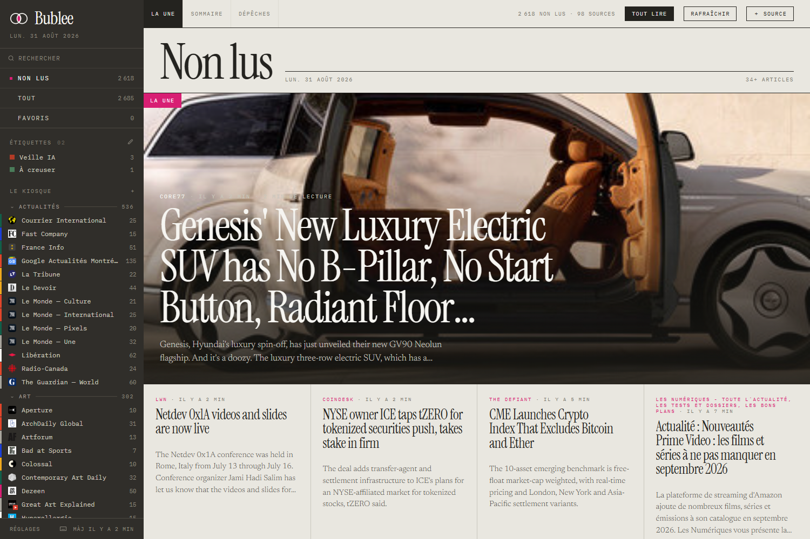
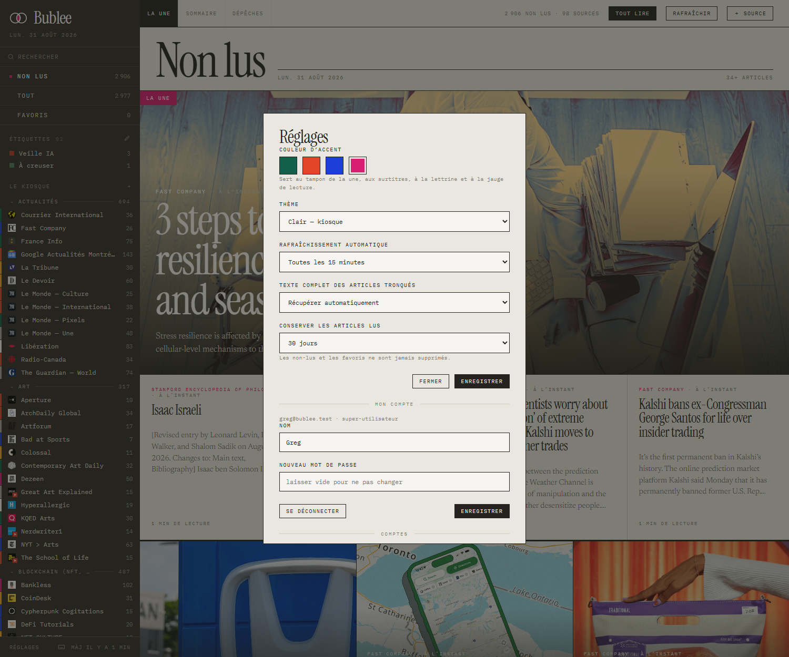
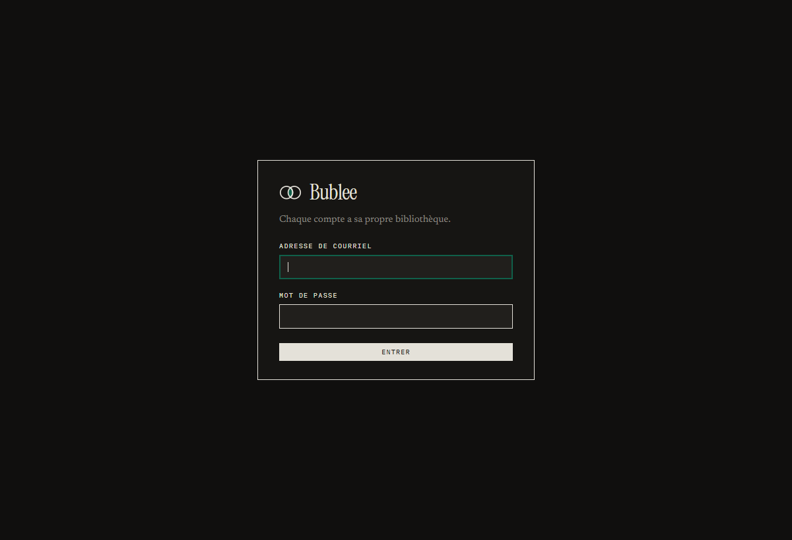
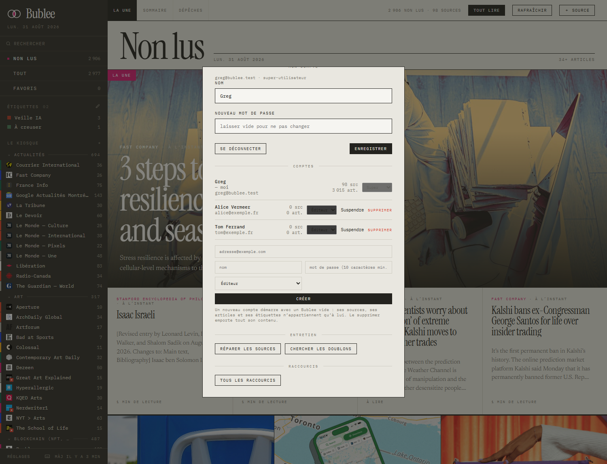

# Bublee

Un lecteur RSS maison, composé comme une première page de journal : index noir,
manchette en serif, grille à filets, angles droits, aucune ombre. Tout ce qui
n'est pas éditorial est en mono capitales. Tout tourne en local, rien ne sort de
la machine à part les requêtes vers les flux eux-mêmes.

<p align="center">
  
  <br><em>« La une » en thème clair — la une plein cadre, la rangée de colonnes,
  le mur d'images, les aplats et les plaques typographiques, puis les dépêches.</em>
</p>

<p align="center">
  
  <br><em>La même page en thème sombre. Le papier et l'encre s'échangent ;
  l'index, lui, était déjà sombre et le reste.</em>
</p>

<p align="center">
  
  <br><em>Le lecteur s'ouvre en panneau : la liste reste là, un clic à côté referme.
  Aeon ne publie qu'un résumé de 27 mots — l'étiquette « texte complet » signale
  les 4 100 mots lus sur la page d'origine.</em>
</p>

<p align="center">
  
  <br><em>Une chaîne YouTube arrive comme n'importe quelle source, avec son lecteur.</em>
</p>

<p align="center">
  
  <br><em>La couleur d'accent se choisit dans les réglages : forêt, vermillon, Klein, magenta.</em>
</p>

## Démarrer

```bash
npm install
npm start
```

Le navigateur s'ouvre sur <http://127.0.0.1:4321>. **Au premier démarrage,
Bublee demande de créer un compte** : le premier devient super-utilisateur et
reprend la bibliothèque déjà en base, s'il y en a une. Ensuite, c'est lui qui
ouvre les comptes suivants — il n'y a pas d'inscription publique.

La base SQLite vit dans `data/bublee.db` — c'est le seul fichier à sauvegarder.
Le cache disque des images, à côté, se reconstruit tout seul.

| Variable            | Défaut      | Effet                                              |
|---------------------|-------------|----------------------------------------------------|
| `PORT`              | `4321`      | port d'écoute                                       |
| `HOST`              | `127.0.0.1` | mettre `0.0.0.0` pour lire depuis le téléphone      |
| `BUBLEE_DATA`       | `./data`    | emplacement de la base                              |
| `BUBLEE_AUTH`       | `lan`       | portée de l'API : `lan`, `strict` ou `off`          |
| `BUBLEE_TOKEN`      | —           | impose un jeton d'API au lieu de celui généré       |
| `BUBLEE_NO_OPEN`    | —           | si défini, n'ouvre pas le navigateur au démarrage   |
| `BUBLEE_IMG_CACHE_MB` | `512`     | plafond du cache disque des images                  |

Pour lire depuis un autre appareil du réseau :

```bash
HOST=0.0.0.0 npm start
```

## Ce que ça fait

- **Ajouter une source** par l'adresse du flux *ou* simplement celle du site :
  la découverte lit les `<link rel="alternate">` de la page, et à défaut teste
  les chemins classiques (`/feed`, `/rss.xml`, `/atom.xml`…).
- **Importer / exporter en OPML** — l'export Feedly passe tel quel, dossiers compris.
- **Chaînes YouTube et podcasts** agrégés comme n'importe quelle source, avec
  leur lecteur intégré (voir plus bas).
- **Étiquettes** colorées, posées à la main, interrogeables par l'API.
- **Formats** : RSS 2.0, RSS 1.0 (RDF) et Atom, avec `content:encoded`,
  `media:content`, `dc:creator`, encodages latin-1, ETag / Last-Modified.
- **Texte complet** des articles que le flux ne publie qu'en résumé (voir plus bas).
- **Déduplication** des histoires reprises par plusieurs sources (voir plus bas).
- **Trois mises en page** : magazine (une + grille), liste, compact.
- **Lecture intégrée** : contenu nettoyé, lettrine, temps de lecture,
  barre de progression, enchaînement vers l'article suivant.
- **Priorité par source** : toutes les sources ne se lisent pas pareil (voir plus bas).
- **Recherche plein texte** dans le corps des articles, accents ignorés.
- **Non lus / favoris / recherche**, dossiers, compteurs, rafraîchissement
  automatique, purge des vieux articles lus (jamais les non-lus ni les favoris).
- **Thème clair « kiosque » et sombre « encre »**, ou automatique, et **couleur d’accent** au choix.

## Comptes et rôles

<p align="center">
  
  <br><em>La porte. Au tout premier démarrage, elle propose de créer le compte
  qui deviendra super-utilisateur et reprendra la bibliothèque existante.</em>
</p>

Bublee n'avait pas d'authentification : il tournait sur une machine de bureau,
et le contrôle d'accès dispensait tout le réseau privé de jeton. Derrière un
proxy, dont l'adresse est justement privée, cette dispense laissait passer
l'internet entier. Elle a disparu : **l'identité vient de la session ou du
jeton, jamais de l'adresse IP.**

**Deux rôles.** `super` administre les comptes en plus du sien ; `editeur` n'a
que le sien. Pas de troisième rôle en lecture seule : ce serait un cas de plus
à vérifier partout pour un besoin qui n'existe pas.

**Chaque compte possède ses sources**, et les articles en descendent par
cascade. L'alternative — des flux partagés et des abonnements — économiserait
les téléchargements quand deux personnes suivent la même source, mais elle
déplacerait l'état de lecture dans une table à part et ferait dépendre
l'isolation d'un `WHERE user_id` jamais oublié sur quatre-vingts requêtes. Ici
l'isolation est structurelle : supprimer un compte emporte tout ce qui lui
appartient, et la déduplication ne rapproche jamais deux articles de comptes
différents — deux personnes qui suivent Le Monde ont chacune leur exemplaire de
la même dépêche.

**Le premier compte créé devient super** et reprend la bibliothèque d'avant les
comptes. Ensuite, plus d'inscription ouverte : c'est un super qui crée les
comptes. Un formulaire public sur une adresse exposée invite le tout-venant, et
chaque compte coûte du réseau et du CPU réels.

**Les mots de passe** sont dérivés avec scrypt (`N=2¹⁵`), de la bibliothèque
standard : bcrypt et argon2 demandent une compilation native, ce qui rendrait
le déploiement dépendant d'une chaîne de build. Dix caractères minimum, sans
rituel de majuscules et de chiffres — c'est la longueur qui compte.

**Les sessions** durent trente jours et se prolongent à l'usage. Le cookie est
`HttpOnly`, `SameSite=Lax`, et `Secure` dès que la connexion est en HTTPS. La
base ne garde que l'**empreinte** du jeton : une copie de la base ne donne pas
les sessions en cours. Suspendre un compte ferme les siennes immédiatement.

**Garde-fous** : le dernier super ne peut être ni rétrogradé, ni suspendu, ni
supprimé ; un super ne peut pas se retirer à lui-même son rôle ; et changer son
mot de passe exige de connaître l'ancien, sinon une session volée suffirait à
s'approprier le compte pour de bon.

**Le jeton d'API est personnel**, un par compte, révocable sans toucher aux
autres.

<p align="center">
  
  <br><em>Réglages → Comptes. Chaque ligne montre ce que le compte possède
  réellement ; le sien ne peut être ni suspendu ni supprimé depuis là.</em>
</p>

## Le dessin

Trois familles, et une règle : **aucun texte d'interface n'est en sans-serif.**

| Rôle | Famille |
|---|---|
| Manchettes, titres, monogrammes, lettrine | **Instrument Serif** |
| Corps de texte, chapôs, titres de dépêches | **Newsreader** |
| Méta, surtitres, boutons, compteurs, heures | **IBM Plex Mono**, capitales |

`border-radius: 0` partout, aucune ombre, aucun flou : la hiérarchie tient aux
filets et aux aplats.

La **marque** est la seule exception, et c'est ce qui la rend reconnaissable :
deux bulles qui se recouvrent, tracées au même filet que le reste de la page,
l'intersection remplie à l'accent. Ce sont les seules courbes de toute
l'interface. Le dessin dit aussi ce que fait l'app — deux sources qui se
croisent, le recoupement mis en valeur plutôt que subi. Cliquer le logo
ramène aux non-lus.

Les noirs sont **chauds et jamais purs** : l'encre est `#24231f`, l'index
`#302e2a`, le fond des blocs photo `#1b1a17`. Un aplat noir franc contre le
papier crème donnait 15,7:1 à la lisière — une arête qui fatigue sur une page
qu'on lit longtemps. On est à 10,5:1, très au-dessus du seuil AAA (7:1), et
les gris de l'index ont monté d'autant pour garder le même rapport sur un
fond éclairci. L'**accent** est une variable unique — tampon de la une,
surtitres, filet qui se dessine au survol, pastilles de non-lu, lettrine, jauge
de lecture. Quatre valeurs au choix dans les réglages : forêt `#10604a` (par
défaut), vermillon `#e2452a`, Klein `#1b3fd8`, magenta `#d81e73`.

**Deux thèmes**, et la bascule dans les réglages : clair, sombre, ou d'après le
système. Le sombre échange le papier et l'encre — mais pas tout. L'index reste
sombre dans les deux : il l'était déjà en clair, c'est sa nature de kiosque.
Et `--paper` ne s'inverse pas non plus : ce jeton ne veut pas dire « fond de
page », il veut dire « encre claire posée sur un fond sombre », et il n'a
aucune raison de foncer parce que la page a foncé. L'avoir inversé une fois
avait retourné les plaques de la une — titres blancs sur fond devenu blanc.

Chaque source reçoit une **teinte** stable parmi six (plus deux neutres), tirée
du hachage de son titre. Elle sert à trois endroits : la barre de 3 px dans
l'index, le monogramme quand il n'y a pas de favicon, et le fond des plaques.

Trois mises en page, indépendantes de la vue :

- **La une** — une plein cadre, rangée de quatre colonnes séparées par des filets
  verticaux, mur d'images, aplats de couleur et plaques typographiques, dépêches
  en fin de page. Le rythme se répète à mesure qu'on descend.
- **Sommaire** — entrées numérotées, vignette de 150 × 104.
- **Dépêches** — lignes denses ; le survol inverse la ligne en encre, c'est le
  seul renversement de la page et il sert de curseur.

Dans les vues d'ensemble — « Non lus », « Tout », « Favoris » —, chaque carte
porte la **pastille de son dossier** : les articles y viennent de partout et
rien d'autre ne dit d'où. Elle disparaît dans un dossier ou sur une source
précise, où elle se répéterait. C'est un contour, pas un aplat : les étiquettes
posées à la main sont pleines, et les deux marques ne doivent pas se confondre —
l'une dit d'où vient l'article, l'autre ce qu'on en a décidé.

Dans l'index, la **pastille de type** distingue les sources : rien pour un
article, un carré rouge à triangle pour une chaîne vidéo, un carré ocre à barres
de niveau pour un podcast.

L'**index** se replie entièrement — le chevron dans son en-tête, ou <kbd>B</kbd> —
et la scène récupère toute la largeur ; le ☰ de la barre d'outils le ramène.
Replier plutôt que réduire à une barre de pictogrammes : un nom de source ne se
résume pas à une icône, et une demi-mesure ne rendrait presque rien. L'état est
retenu et appliqué avant le premier rendu, comme le thème.

Il se règle aussi à la largeur qu'on veut : une poignée sur son bord droit,
de 240 à 460 px, double-clic pour revenir à 266. Les noms de sources longs ne
sont plus tronqués dès qu'on lui donne une centaine de pixels de plus. La
largeur tient dans le navigateur, pas sur le serveur — c'est un réglage d'écran,
pas de compte, et elle s'applique avant le premier rendu pour éviter le saut.

**Sur un téléphone**, la grille passe à une colonne et l'index devient un
tiroir. Le piège s'y cachait dans une valeur par défaut : `grid-template-columns:
1fr` vaut `minmax(auto, 1fr)`, et ce minimum automatique est la largeur minimale
du contenu. La barre d'outils en réclamait 656 px ; la colonne s'élargissait
d'autant, la fenêtre de rendu avec elle, et toute la page se mettait à défiler
latéralement — sur un écran de 375 px, elle en occupait 638. `minmax(0, 1fr)`
autorise la colonne à descendre sous son contenu, et le débordement disparaît.

La barre elle-même est resserrée pour tenir : « ＋ Source » la quitte, l'ajout
restant à portée par le « + » du kiosque dans l'index. Elle garde un défilement
horizontal comme filet — elle tient entière à 375 px, elle se décale un peu
en dessous plutôt que de casser la page.

Le **lecteur** est un panneau ancré à droite, pas une page plein écran. Il prend
`min(1080px, 100vw − 180px)` : assez large pour une colonne de texte confortable,
en laissant voir la liste par-dessous — cliquer dedans referme, comme `Échap`.
Sous 1100 px la lisière tombe à 72 px, et sous 720 px le panneau prend tout
l'écran : une lisière de 72 px, au doigt, se toucherait par accident.

Au doigt, il se parcourt au **glissé**, puisqu'il occupe tout l'écran : vers la
gauche pour l'article suivant, vers la droite pour revenir au précédent — et,
une fois revenu à celui qu'on avait ouvert depuis la liste, pour refermer. C'est
le geste « retour » du téléphone, et il évite d'aller chercher une croix en haut
de l'écran à chaque article.

Le panneau suit le doigt **au point près** et s'estompe à mesure : le geste se
voit avant d'aboutir. Au relâchement il ne revient pas au centre pour laisser le
contenu changer d'un coup — l'article s'en va du côté du geste, et le suivant
arrive de l'autre bord. Le chargement court pendant la sortie, sinon on
attendrait le réseau devant un panneau vide. Un geste abandonné revient au repos
sur un ressort plutôt que sur un rappel sec.

Un article enchaîné ne rejoue pas l'entrée du panneau : il est déjà là, seul son
contenu change. Et le geste coupe net l'animation d'ouverture — tant qu'elle
court, ses images clés l'emportent sur le style en ligne, et un doigt posé
aussitôt ne déplacerait rien.

Vers la gauche sans article suivant, le panneau résiste comme un élastique au
lieu de promettre un passage qui n'aura pas lieu. Trois garde-fous : sous 70 px c'est une hésitation et rien ne
bouge ; l'horizontale doit l'emporter franchement sur la verticale, sinon un
défilement un peu oblique ferait trembler le panneau ; et un geste parti dans un
tableau ou un bloc de code qui défile déjà horizontalement lui laisse la
priorité.

À cette largeur, son bandeau se déleste pour tenir sur une seule ligne. Partent
la méta — que le titre juste en dessous répète —, « Texte complet » et
« Non lu ». Le premier n'est pas une perte : le texte se récupère tout seul à
l'ouverture, et quand l'extraction échoue le bandeau d'erreur porte son propre
« réessayer ». Le second fait revenir en arrière, ce qui se fait rarement au
doigt. Restent fermer, étiqueter, mettre en favori, ouvrir l'original.

## Texte complet

Beaucoup d'éditeurs ne diffusent qu'un résumé dans leur flux. À l'ouverture
d'un article jugé tronqué (moins de 250 mots, réglable), Bublee va lire la
page d'origine, en extrait l'article avec Readability, le renettoie et le
garde en base : les fois suivantes, l'affichage est instantané.

- Le résumé du flux s'affiche tout de suite ; le texte complet le remplace
  dès qu'il arrive. Un bandeau signale l'opération.
- <kbd>F</kbd> (ou le bouton de la barre de lecture) force la récupération,
  même sur un article que Bublee n'estimait pas tronqué.
- Un site qui refuse la lecture automatique (Cloudflare, mur payant) affiche
  la raison et le lien vers l'original. L'échec n'est pas retenté avant 24 h.
- **Une extraction ratée est refusée plutôt qu'affichée.** Readability se trompe
  parfois de bloc et rend la page entière — sur un « bon plan », c'est tout le
  comparateur de prix qui arrive : des centaines de lignes de marchands autour
  de trois paragraphes utiles. Ça se voit au nombre de balises rapporté au
  texte : un paragraphe, c'est une balise pour cent-cinquante caractères ; une
  ligne de comparateur, huit balises pour trente. Sur la bibliothèque réelle,
  tout ce qui était lisible plafonnait à 42 balises par millier de caractères et
  les pages ratées démarraient à 95 — le seuil est posé à 70. Une galerie
  d'architecture monte aussi haut, mais parce qu'elle est faite d'images : on ne
  compte donc que le balisage que les images n'expliquent pas. L'article refusé
  garde son résumé et son lien, ce qui est la bonne réponse pour ces pages.
- `node scripts/purger-extractions.mjs` repasse les textes déjà en base devant
  ce contrôle ; `--purger` efface ceux qui ne passent plus.
- Désactivable dans les réglages.

## Priorité par source

Le vrai problème d'un agrégateur n'est pas de collecter, c'est le débit. Sur
98 sources il entre ici **225 articles par jour** : la pile de non-lus croît
toute seule, et la rétention ne purge que les articles *lus*. Aucune étiquette
ni aucun partage ne répond à ça — ils servent une fois qu'on a décidé quoi lire.

Chaque source porte donc une priorité, réglable dans « Modifier la source » :

| Priorité | Non lus | Tout | Sa propre vue |
|---|---|---|---|
| **Suivie** (défaut) | oui | oui | oui |
| **Survol** | non, mais dans sa vue « Survol » | oui | oui |
| **Muette** | non | non | oui |

Le principe tient en une phrase : **la priorité ne joue que sur les vues
d'ensemble.** Cliquer une source, ouvrir un dossier, suivre une étiquette ou
chercher, c'est demander explicitement — et on ne cache rien à quelqu'un qui est
allé chercher. Une source muette n'est pas désabonnée : elle continue d'être
collectée, dédupliquée, indexée. Elle cesse seulement d'appeler.

Dans l'index, une source en survol a son compteur en gris ; une source muette a
sa ligne entière estompée, qui se rallume au survol. Une vue « Survol »
apparaît sous les non-lus dès qu'une source y est placée, et disparaît sinon —
pas de ligne morte pour qui ne se sert pas de la fonction.

```bash
curl -X PATCH http://127.0.0.1:4321/api/feeds/17   -H 'content-type: application/json' -d '{"priority":"survol"}'
```

## Recherche

La recherche portait sur le titre, le résumé et l'auteur. Elle porte maintenant
sur **le corps entier des articles**, texte complet récupéré compris, via un
index FTS5.

- **Les accents sont ignorés** des deux côtés : `quebec` trouve « Québec ».
- **Le dernier mot est cherché par préfixe**, pour que la liste se resserre
  pendant la frappe et pas au dernier caractère.
- **Rien de ce qu'on tape ne devient un opérateur** : seuls les lettres et les
  chiffres sont extraits, chaque mot est cité, et `AND` tapé par mégarde reste
  le mot « and ».
- **Le balisage n'est pas indexé.** Le corps est nettoyé de son HTML avant de
  l'être — sinon `` et `<span>` deviendraient des mots, et chercher « src »
  remonterait la moitié de la bibliothèque. Le nettoyage est une fonction SQL
  appelée par des déclencheurs, ce qui garantit que l'index ne peut pas dériver
  de la table quel que soit le chemin d'écriture.

L'index se remplit tout seul au premier démarrage qui suit la mise à jour.

## Déduplication

C'est le point qui pose problème sur Feedly : la même histoire revient trois
fois parce que trois sources la relaient, ou parce que l'éditeur a republié
son article avec un nouvel identifiant.

Deux articles sont rapprochés quand :

1. **leur adresse normalisée est identique** — schéma, `www`, fragment,
   paramètres de tracking (`utm_*`, `fbclid`, `xtor`…), variantes AMP et
   mobiles, `index.html` et barre oblique finale sont ignorés ;
2. **ou** leur **titre normalisé** est identique — sans accents, sans
   ponctuation, sans le nom du site collé en fin de titre — à condition que
   le titre fasse au moins 30 caractères et que les deux publications soient
   séparées de moins de 36 heures.

Deux garde-fous, appris sur de vrais flux :

- une adresse **sans chemin** (`https://exemple.fr/`) n'identifie rien : de
  nombreux podcasts mettent la racine du site sur chaque épisode. Elle est
  ignorée ;
- à l'intérieur d'**un même flux**, une adresse commune ne suffit pas : le
  titre doit concorder, sinon ce sont deux entrées distinctes.

Ce qui en découle :

- l'exemplaire le plus ancien fait référence, les copies lui sont rattachées ;
- hors d'un flux précis, une histoire n'apparaît **qu'une fois** ; en ouvrant
  un flux, sa liste reste complète ;
- lire, mettre en favori ou tout marquer comme lu **s'applique au groupe** :
  aucune copie ne ressort ailleurs comme non lue ;
- le lecteur indique « Aussi publié par… » quand plusieurs sources la portent.

Sur une base déjà remplie (import OPML), le rapprochement est lancé au
premier démarrage. Pour le rejouer :

```bash
curl -X POST 'http://127.0.0.1:4321/api/dedupe?rebuild=1'
```

## Illustrations

Une carte de magazine sans image fait un trou. Bublee cherche l'illustration
dans cet ordre :

1. `media:content`, `media:thumbnail`, `enclosure`, `itunes:image` — y compris
   quand le flux **ne déclare pas** que la pièce jointe est une image, ce qui
   est fréquent (ArchDaily, par exemple, envoie une `<enclosure>` nue) ;
2. la première image du contenu, hors pixels de suivi ;
3. à défaut, l'`og:image` de la page de l'article, cherchée en tâche de fond
   après chaque rafraîchissement, par paquets, et une seule fois par article.

Les images passent ensuite par le relais local, ce qui contourne les
protections anti-hotlink. Il reste des cas sans issue : un site qui répond 403
aux robots (le New York Times, par exemple) ne livrera ni image ni texte.
La carte reçoit alors une **plaque typographique** : l'initiale de l'article
en gros serif débordant du cadre, le nom de la source en petites capitales,
et une teinte propre à chaque source. Une composition, pas un trou.

## Couleurs d'attente

Les illustrations n'arrivent pas toutes en même temps, et la grille se
retrouvait trouée de blancs le temps qu'elles se posent. Chaque emplacement
porte donc un fond : **deux teintes moyennes de l'image elle-même**, celle du
haut et celle du bas, en dégradé — soit une version très floue de la photo qui
va s'y poser. L'image arrive ensuite en fondu par-dessus.

Le serveur n'a pas de décodeur d'image, et en ajouter un pour ça serait cher
payé. C'est donc **le navigateur qui mesure**, une seule fois : à la première
image affichée, elle est réduite à 16 × 16 dans un canevas, moyennée par
moitié, et la paire est renvoyée à l'API — qui vérifie le format avant de
l'enregistrer, puisqu'elle vient du client. Tous les affichages suivants, sur
n'importe quel appareil, ont la couleur d'emblée.

Le calcul attend que le navigateur soit libre (`requestIdleCallback`) et ne
tourne que deux à la fois : il ne doit jamais disputer une image de plus au
défilement. Les illustrations passent par `/api/image`, donc même origine — le
canevas n'est pas souillé et reste lisible.

Tant qu'une couleur n'est pas connue, c'est la teinte de la source qui tient la
place. Et si une image ne charge pas du tout, le fond reste : mieux qu'une
icône cassée.

### Le cache disque du relais

Sans lui, chaque affichage d'une vignette repartait chercher l'octet chez
l'éditeur : le fond d'attente restait en place le temps de l'aller-retour, et
on refaisait le trajet dès que le cache du navigateur expirait ou qu'un autre
appareil regardait la même page. Désormais, seule la première vue paie le
voyage.

    1re vue  0,110 s (12 756 o)  →  2e vue  0,024 s   [x-bublee-cache: disque]
    1re vue  0,083 s (10 447 o)  →  2e vue  0,016 s   [x-bublee-cache: disque]

Un fichier par image dans `data/cache-images`, nommé d'après l'**empreinte
SHA-256 de son adresse** — jamais d'après l'adresse elle-même, qui pourrait
sortir du dossier. Le type MIME tient sur la première ligne du fichier : pas
d'index à maintenir, donc pas d'index à désynchroniser. L'écriture passe par un
fichier temporaire puis un renommage, pour qu'une lecture concurrente ne tombe
jamais sur un fichier à moitié écrit.

Le cache est plafonné (512 Mo par défaut, `BUBLEE_IMG_CACHE_MB`). Au-delà, les
entrées les moins récemment lues sont effacées jusqu'à redescendre à 90 % —
pas à 100 %, sinon on rebalaierait au fichier suivant. Le balayage ne tourne
qu'une fois toutes les dix minutes : le déclencher à chaque écriture
reviendrait à lire tout le dossier à chaque vignette. Et la date d'accès n'est
rafraîchie qu'une fois par jour, sinon afficher une page coûterait une écriture
par image.

L'en-tête `x-bublee-cache` dit d'où vient l'octet, `disque` ou `reseau`, et
`/api/health` donne l'état du cache.

## Sources injoignables

Un export Feedly ancien contient des adresses mortes. « Réparer les sources
injoignables », dans les réglages, interroge pour chacune la page du site,
puis le domaine, puis l'ancienne adresse (qui redirige parfois).

Un remplacement n'est appliqué **automatiquement** que si le titre du flux
trouvé concorde vraiment avec l'ancien. Sinon Bublee se contente de proposer,
avec un pourcentage de ressemblance et un bouton « Adopter » : un site
n'expose souvent que son flux général, et remplacer en silence
« Pitchfork — Best New Tracks » par « Pitchfork » serait pire que de laisser
la source cassée. Chaque candidat est téléchargé et analysé avant d'être
proposé, et l'ancienne adresse est restaurée si le nouveau flux ne répond pas.

L'adresse reste modifiable à la main dans la fiche de la source.

## API

Tout ce que fait l'interface passe par une API REST en JSON, utilisable
depuis un script, un raccourci ou un autre service.

```bash
curl http://127.0.0.1:4321/api          # la liste des routes
curl http://127.0.0.1:4321/api/health   # état et compteurs
```

**Accès.** Un jeton est généré au premier démarrage et affiché dans la console
(et dans `GET /api/token` depuis la machine locale). `BUBLEE_AUTH` règle la portée :

| Valeur   | Qui passe sans jeton                    |
|----------|------------------------------------------|
| `lan`    | machine locale **et** réseau privé (défaut) |
| `strict` | machine locale seulement                 |
| `off`    | tout le monde                            |

Depuis l'extérieur :

```bash
curl -H "Authorization: Bearer $BUBLEE_TOKEN" http://192.168.1.20:4321/api/articles?view=unread
```

CORS est ouvert (avec le jeton), donc une page web tierce peut appeler l'API.

**Routes principales**

| Méthode  | Route                     | Rôle |
|----------|---------------------------|------|
| `GET`    | `/api/state`              | flux, dossiers, compteurs, réglages |
| `GET`    | `/api/articles`           | `view=unread\|all\|starred`, `feed`, `folder`, `q`, `limit`, `before` |
| `GET`    | `/api/articles/:id`       | un article et son contenu |
| `PATCH`  | `/api/articles/:id`       | `{ "read": true }` · `{ "starred": true }` |
| `POST`   | `/api/articles/:id/full`  | récupérer le texte complet (`?force=1`) |
| `POST`   | `/api/articles/read`      | `{ "all": true }` · `{ "feedId": 3 }` · `{ "ids": [1,2] }` |
| `POST`   | `/api/feeds`              | `{ "url": "…", "folder": "…" }` |
| `DELETE` | `/api/feeds/:id`          | supprimer une source |
| `POST`   | `/api/refresh`            | rafraîchir toutes les sources |
| `POST`   | `/api/feeds/repair`       | chercher l'adresse des sources injoignables |
| `POST`   | `/api/feeds/:id/repair`   | chercher pour une source ; `{ "url": "…" }` adopte une proposition |
| `POST`   | `/api/articles/images`    | chercher les illustrations manquantes |
| `GET`    | `/api/tags`               | étiquettes, teintes, nombre d'articles |
| `POST`   | `/api/tags`               | créer une étiquette `{ "name": "…" }` |
| `POST`   | `/api/articles/:id/tags`  | `{ "add": [...] }` · `{ "remove": [...] }` · `{ "set": [...] }` |
| `PATCH`  | `/api/tags/:id`           | renommer (fusionne) ou reteindre `{ name?, color? }` |
| `DELETE` | `/api/tags/:id`           | supprimer une étiquette |
| `POST`   | `/api/dedupe`             | rapprocher les doublons (`?rebuild=1`) |
| `POST`   | `/api/opml/import`        | corps = XML OPML |
| `GET`    | `/api/opml/export`        | export OPML |

Exemples :

```bash
# les dix derniers non lus, en une ligne par titre
curl -s 'http://127.0.0.1:4321/api/articles?view=unread&limit=10' \
  | jq -r '.articles[] | "\(.feed_title) — \(.title)"'
```

```bash
# ajouter une source dans un dossier
curl -s -X POST http://127.0.0.1:4321/api/feeds \
  -H 'content-type: application/json' \
  -d '{"url":"korben.info","folder":"Tech"}'
```

## Chaînes YouTube

YouTube n'affiche plus de bouton RSS, mais publie toujours un flux Atom par
chaîne et par liste de lecture. Colle n'importe quelle adresse YouTube dans
« Ajouter une source » — Bublee retrouve le flux :

| Ce que tu colles | Ce que Bublee en fait |
|---|---|
| `youtube.com/@monsieurphi` | lit la page pour trouver l'identifiant de chaîne |
| `youtube.com/channel/UC…` | conversion directe, sans requête |
| `youtube.com/playlist?list=…` | flux de la liste de lecture |
| `youtube.com/watch?v=…` | remonte à la chaîne de la vidéo |

Les vidéos arrivent comme les articles : miniature, titre, auteur, date,
description. La carte porte un bouton de lecture, et le lecteur intègre le
player YouTube — en `youtube-nocookie.com`, sans quitter Bublee. Les liens et
les chapitres de la description restent cliquables. Ni temps de lecture ni
récupération de texte complet sur une vidéo : ça n'aurait pas de sens.

## Partager

Le second pictogramme du coin d'une carte ouvre les destinations : **courriel**,
**WhatsApp**, **Signal**, **Telegram**, **copier le lien** — et, sur les
navigateurs qui la portent, la **feuille de partage du système**, qui donne
accès à tout ce qui est installé sur la machine. Chaque ligne porte son propre
pictogramme : à la lecture rapide, c'est lui qu'on vise, pas le mot.
<kbd>P</kbd> fait la même chose sur l'article au curseur, ou sur celui qu'on est
en train de lire. Sous le titre, dans le lecteur, la même paire de pictogrammes
ferme la ligne des étiquettes.

Rien n'est envoyé par Bublee : chaque destination ouvre sa propre fenêtre de
rédaction, pré-remplie du titre et du lien. C'est toi qui postes. La ligne
« Partager… » n'apparaît que si le navigateur porte vraiment l'API — pas de
bouton qui ne ferait rien.

Signal fait exception : il n'a pas d'adresse web de partage, on passe donc par
le protocole `sgnl://` que l'application installe. S'il n'est enregistré nulle
part, le navigateur ne signale rien — Bublee guette la perte de focus, qui
signe la prise en charge, et prévient si elle ne vient pas. La feuille du
système reste le chemin le plus sûr vers Signal quand elle est disponible.

## Podcasts

Un podcast, c'est un flux RSS. Colle son adresse et Bublee en fait des
articles écoutables : le lecteur audio ouvre le contenu, la durée annoncée
par le flux (`itunes:duration`) remplace le temps de lecture, et la carte
porte un bouton de lecture. Rien à récupérer sur la page d'origine : le
contenu d'un épisode, c'est son audio.

Où trouver l'adresse : la plupart des podcasts publient leur flux RSS sur
leur propre site. Pour ceux hébergés ailleurs, Apple Podcasts, Podcast Addict
ou [getrssfeed.com](https://getrssfeed.com) donnent l'adresse à partir du lien
de l'émission.

**Spotify est un cas à part.** La plateforme ne publie pas de flux RSS pour
les émissions qu'elle héberge, et ses exclusivités n'existent nulle part
ailleurs — aucun lecteur tiers ne peut les récupérer. En revanche l'immense
majorité des podcasts *diffusés sur* Spotify ont un flux public : c'est
celui-là qu'il faut donner à Bublee.

## Étiquettes

Poser une étiquette sur un article, c'est le retrouver ensuite — dans
l'interface comme par l'API.

- **Sans ouvrir l'article** : au survol d'une carte, deux pictogrammes
  apparaissent dans son coin — une étiquette et un partage. Le premier ouvre la
  liste des étiquettes : un clic pose ou retire, le champ du bas en crée une.
  <kbd>T</kbd> fait la même chose sur l'article au curseur. Les étiquettes
  posées s'affichent ensuite dans la carte elle-même, dans les trois mises en
  page.
- Le bouton ne se superpose à rien : là où la carte porte déjà une méta à
  droite — la source d'une dépêche, la durée d'un aplat — cette méta s'efface le
  temps du survol et le bouton prend sa place. Rien ne bouge, rien ne se
  chevauche.
- Dans le lecteur, sous le titre : les étiquettes de l'article, chacune
  retirable, et un champ pour en ajouter (<kbd>T</kbd> y place le curseur).
  Plusieurs d'un coup en les séparant par des virgules.
- Dans la colonne de gauche, la section **Étiquettes** liste les tiennes avec
  leur nombre d'articles ; un clic filtre. Le crayon ouvre le gestionnaire :
  renommer, reteindre, supprimer, ou créer une étiquette vide.
- Chaque étiquette porte une **teinte** parmi huit, attribuée à la création et
  modifiable. Elle sert de repère dans la liste comme dans le lecteur.
- Renommer une étiquette avec le nom d'une autre **fusionne** les deux.
- Les variantes de casse et d'espacement retrouvent l'étiquette existante au
  lieu d'en créer une jumelle.
- Comme la lecture et les favoris, une étiquette s'applique au **groupe de
  doublons** : l'article reste retrouvable quelle que soit la source par
  laquelle on l'a lu.

Par l'API :

```bash
# étiqueter
curl -X POST http://127.0.0.1:4321/api/articles/482/tags \
  -H 'content-type: application/json' \
  -d '{"add":["veille IA","à lire"]}'

# tout ce qui porte une étiquette
curl -s 'http://127.0.0.1:4321/api/articles?view=all&tag=veille%20IA' | jq -r '.articles[].title'

# les deux à la fois (et non l'une ou l'autre)
curl -s 'http://127.0.0.1:4321/api/articles?view=all&tag=veille%20IA,à%20lire'
```

Quatre adresses directes, utiles en marque-page : `#/article/482` ouvre un
article, `#/tags` le gestionnaire d'étiquettes, `#/reglages` les préférences,
`#/shortcuts` l'aide-mémoire.

## Raccourcis clavier

<kbd>?</kbd> à tout moment ouvre l'aide-mémoire, aussi accessible par l'icône
de clavier en bas de la colonne de gauche.

| Touche | Action |
|--------|--------|
| `J` / `K` | article suivant / précédent |
| `1` `2` `3` | vues Non lus / Tout / Favoris |
| `Entrée` ou `O` | ouvrir |
| `M` | lu / non lu |
| `S` | favori |
| `V` | ouvrir l'article original |
| `F` | forcer le texte complet |
| `R` | rafraîchir |
| `A` | ajouter une source |
| `Maj+A` | tout marquer comme lu |
| `G` | changer de mise en page |
| `T` | étiqueter — l’article ouvert, ou celui au curseur dans la liste |
| `P` | partager l’article au curseur |
| `B` | replier ou déplier l’index |
| `/` | rechercher |
| `,` | réglages |
| `?` | aide-mémoire |
| `Échap` | fermer |

## Sous le capot

```
server/
  index.js    routes HTTP, rafraîchissement périodique, relais d'images
  store.js    logique métier : flux, articles, doublons, texte complet
  feed.js     téléchargement et analyse RSS / RDF / Atom, découverte
  dedupe.js   normalisation des adresses et des titres
  readable.js extraction du texte complet (Readability)
  opml.js     import / export OPML
  html.js     nettoyage du HTML des articles
  youtube.js  chaînes YouTube : résolution du flux, lecteur intégré
  http.js     couche réseau commune, garde-fous SSRF
  apikey.js   jeton d'API, portée réseau, CORS
  db.js       schéma SQLite et migrations
public/
  index.html · styles.css · js/{app,api,util}.js
```

Le front est en JavaScript natif (modules ES) : aucune étape de build,
on édite un fichier, on recharge.

Quelques choix à connaître :

- **Le HTML des articles est filtré par liste blanche** (`server/html.js`) :
  scripts, styles, `on*`, `javascript:` sont supprimés ; seules les `<iframe>`
  de lecteurs connus (YouTube, Vimeo, Spotify…) survivent.
- **Les images passent par `/api/image`**, ce qui contourne les protections
  anti-hotlink et évite que les éditeurs voient le lecteur. Le relais refuse
  les adresses privées (anti-SSRF), tout comme l'extraction de texte.
- **Déduplication** sur `(feed_id, guid)` d'abord, puis sur adresse et titre
  normalisés. Un article déjà lu n'est jamais réécrit par une mise à jour du flux.

## Tests

```bash
npm test
```

47 tests : nettoyage HTML, analyse des trois formats de flux, chaînes
YouTube et podcasts, normalisation des clés de comparaison, étiquettes, et
comportement complet de la déduplication — y compris les faux positifs
rencontrés sur de vrais flux.
